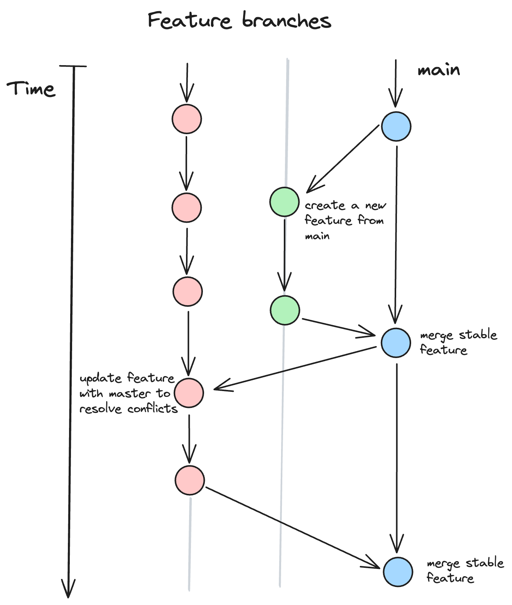

# Workflow

We will use Github Flow ethodology for managing codebases.

## Overview

- **Main branch:** The `main` branch serves as the central point for the latest, stable. This branch should always be deployable.
- **Feature branches:** You create separate branches for each feature or bug fix. These branches are named after the task being worked on, such as `feature/auth` or `bugfix/`;
- **Pull requests:** Once a feature or fix is complete, a pull request (PR) is created to merge the changes into the `main` branch;
- **Continious Deployment:** After a PR is merged into the `main` branch, the changes can be automatically deployed to production;
- **Branch Removal:** After a feature branch is successfully merged into the `main` branch and deployed, it is typically deleted. This keeps the repository clean and avoids clutter from outdated branches.

## Branch Names

- `main`: The primary branch where the latest stable code resides;
- `feature/xyz`: Branches created for a new feature;
- `bugfix/abc`: Branches created to fix bugs or issues.
